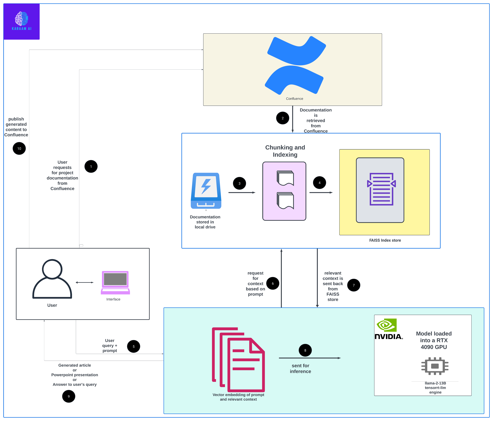

# karaamAI

## Getting started
1. Clone the repo: ```python git clone https://github.com/MustaphaU/karaamAI.git```
2. Navigate to the root folder
3. Download the tensorrt-llm engine and the tensorrt wheel from here: https://www.dropbox.com/scl/fo/3406zfdaxb84o8vwiab8g/h?rlkey=2h599x22h2qa8zjy5028obsh3&dl=0
4. Place the wheel in the `tensorrt_wheel` folder and place the engine in `llama2/engine`
5. Install the tensorrt wheel:
   ```
   pip install tensorrt_wheel/tensorrt_llm-0.7.1-cp310-cp310-win_amd64.whl
   ```
6. Install the other requirements:
```
pip install -r requirements.txt
```

## Launch the app
To launch the app run:
```
streamlit run app.py
```

Your application should take about a minute to start up.. The little delay is necessary for it to fully load the **13B llama model** into the GPU

Once ready, log in with the credentials provided in `credentials.txt` and click `submit`

EDIT 04/03/2024: The API token in `credentials.txt` has been revoked by Atlassian for security reasons. Nonetheless, you should be able to login with your own credentials.

Check out the demo video to see how you might interact with the app.: https://youtu.be/opTpWnb6Ju8 

# Here is a high level architecture



# Motivation 
Confluence by Atlassian improved project documentation, addressing the issue of timeline discrepancies and scope creep. However, the challenge of documentation overload remains, leaving new hires like Chloe to navigate through extensive documentation, and risking burnout.
Chloe has been invited to a project on Atlassian Confluence. She feels nearly overwhelmed by the lengthy  documentation review required to contribute meaningfully to the project. 

Enter KaraamAI! 

KaraamAI will not only help Chloe to quickly get an in-depth gist of the project but will also facilitate new content creation by leveraging key ideas from the existing documentation in the team’s space. The content can be a long form article or a short PowerPoint presentation.
Today, she is tasked with creating a blog and a short presentation on some new APIs. Luckily for Chloe, this API is well documented in the existing space.
Chloe quickly launches the KaraamAI application and logs in with the required credentials.

On successful login, all the articles in the Team’s space are downloaded and indexed in a FAISS vector store. 
Next, she navigates to the content generation interface, enters the title of the article, and clicks submit.
Once generation completes, she can edit, save the changes, and publish the refined version to the Confluence space.
Similar steps can be followed for the short powerpoint presentation. 
Once the presentation is generated, she can download as powerpoint to her device and carryout modifications if necessary. 
Lastly, she can use the ‘Chat with Documentation’ functionality for interactive QA.


